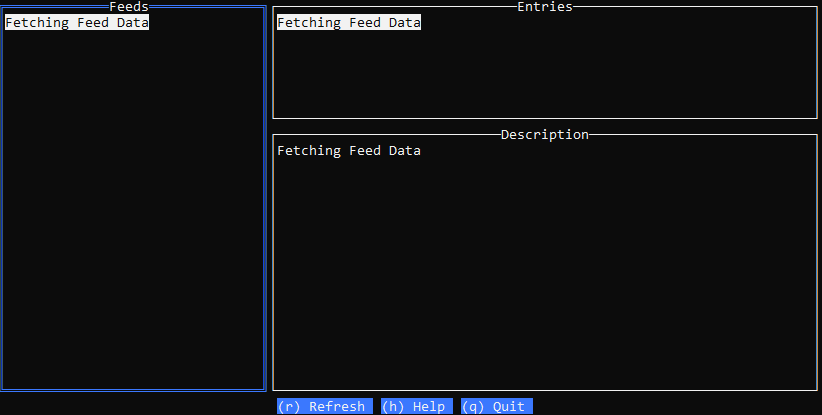

# clacks
A Terminal Atom Reader - reads a list of atom feeds from a json file and asynchronously fetches them.

## Demo


## Config
Json file called feeds.json in the same directory with the following format:
```json
{
  "feeds": [
    {
      "url": "https://www.theregister.com/offbeat/bofh/headlines.atom"
    },
    {
      "url": "https://barryodriscoll.net/feed/atom/"
    },
    {
      "url": "https://boingboing.net/feed/atom"
    }
  ]
}
```

## Instructions
- Add feeds name/url to feeds.json. 
- Navigate lists using arrow keys. 
- Hit enter/esc to select and deselect list items.
- Hit enter on an entry to open in default system browser.  
- Ctrl-C to quit.

## Dependiences 
- [gofeed](https://github.com/mmcdole/gofeed) - feed parser
- [tview](https://github.com/rivo/tview) - terminal ui library
- [html-strip-tags-go](https://github.com/grokify/html-strip-tags-go) - strips html tags
- [gox](https://github.com/icza/gox) - utility library used to open browser cross platform manner

## Credits
- The tview [postgres](https://github.com/rivo/tview/wiki/Postgres) example.
- The tview [presentation](https://github.com/rivo/tview/tree/master/demos/presentation) demo.  
- This stackoverflow [answer](https://stackoverflow.com/questions/39320371/how-start-web-server-to-open-page-in-browser-in-golang) on how to open a browser in go and escape urls on windows by [icza](https://stackoverflow.com/users/1705598/icza).
- Terry Pratchett for the name [clacks](https://discworld.fandom.com/wiki/Clacks).

## TODO
- Add menu functions to refresh, add and remove feeds
- Handle RSS feeds, shouldn't be much extra work as [gofeed](https://github.com/mmcdole/gofeed) supports detecting feed type and handling both.
- Change the border colour of ui element currently active
